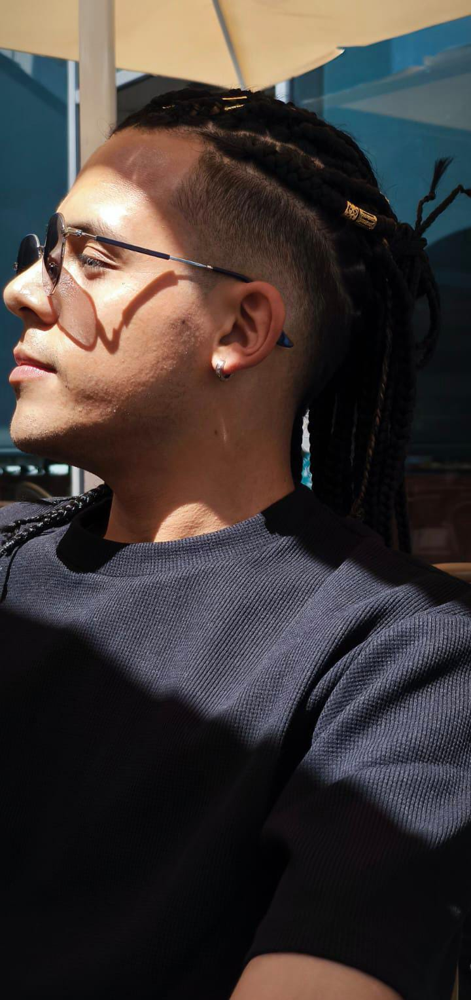

# Proyecto: Arroz con Pollo - Receta y Datos del Equipo

## Descripción del Proyecto
Este proyecto consiste en la documentación y presentación de la receta tradicional del Arroz con Pollo, junto con la información de los miembros del equipo que participan en este trabajo colaborativo.

---

## Receta: Arroz con Pollo

### Ingredientes:
- 2 tazas de arroz
- 1 pollo entero cortado en presas
- 1 cebolla picada
- 2 dientes de ajo picados
- 1 pimiento rojo picado
- 1 tomate grande picado
- 1 taza de guisantes
- 1 zanahoria cortada en cubos
- 4 tazas de caldo de pollo
- Aceite, sal, pimienta y comino al gusto

### Preparación:
1. En una olla grande, calienta aceite y sofríe la cebolla, el ajo y el pimiento hasta que estén dorados.
2. Agrega el pollo y cocina hasta que esté dorado por todos lados.
3. Añade el tomate y cocina por 5 minutos.
4. Incorpora el arroz, mezcla bien y vierte el caldo de pollo.
5. Agrega sal, pimienta y comino al gusto.
6. Cocina a fuego medio hasta que el arroz esté cocido y el líquido se haya absorbido.
7. Añade los guisantes y la zanahoria, cocina por 5 minutos más.
8. Sirve caliente y disfruta.

---

## Información del Equipo

| Nombre        | Rol                       | Ubicación | Comentario personal                  |
|---------------|---------------------------|-----------|------------------------------------|
| German Pachon | Desarrollador de videojuegos | Bogotá    | Me gusta cocinar y aprender código |

---

## Repositorio y Comunicación

- Repositorio SCV: [inserta aquí el enlace a tu repositorio]
- Canal de comunicación: [inserta aquí el enlace al canal Teams o similar]

---

## Evidencia de la Actividad

Comparto las capturas de pantalla que muestran el inicio del trabajo colaborativo, el reconocimiento del entorno virtual y la conformación del equipo.

# German Pachon

**Rol:** Desarrollador de videojuegos  
**Ubicación:** Bogotá, Colombia  
**Perfil:** Apasionado por la programación y el desarrollo de videojuegos, me gusta trabajar en equipo y aprender nuevas tecnologías.     

# Andres Tenjo

**Rol escogido:** Diseñador de Sonido.

**Ubicación:** España

Mi nombre es Andres Tenjo, tengo 24 años de edad.  
Actualmente vivo en España y estudio Ingeniería Multimedia, además me encanta el arte y la fotografía.

Mi comida favorita es: La pizza.

